<!-- _class: cover -->


# Open source

## How do I open source my own libraries

<!--
Excerpt 

-->
---


<!--  -->

# About me

```yaml
Name: Vincent Free
Title: Engineer V
Tribe: GITEO
Age: 36
Experience:
  - Golang
  - Kotlin / Java
  - Containerization(k8s, swarm)
  - Observability
```

<!--
GITEO: Global IT Engineering & Operations
-->

---

# Agenda

- Starting an open source project
- Getting the quality up to par
- Writing documentation
- ExampleTests
- What about performance/overhead?
- Publishing your work

---
<!-- _class: demo -->

# Where to start?

---

# The idea

> Do I really need something great to contribute to the (Go) community to start out?

The answer is simple: **No**

- Start small
- Abstract repeated code blocks
- Ask your self if it would add value for others

<!--
You could start with something you feel you're repeating over and over. For me it started with a rather small function for adding trace telemetry data to a log.
-->


---

# License to operate

**Always** release under a license

Pick what fits for you, think of the implications

Things to think about:

- Allowing commercial use
- Distribution/modification rights
- Copyright notice
- Liability
- Warranty


---

# Tooling

- GitHub (or similar tooling)
  - CI/CD
  - Community
  - Issue tracking
  - Security advisory(code/dependency/secrets)
  - Dependency management(Dependabot)

- GoReleaser*

> *Very useful tool, I have not used it in my setup due to semver versioning issues

---

<!-- _class: demo -->
# OSS grade Quality

---

# Code style difference

The codebase is public facing, this requires (even) more from the quality of the codebase.

- `doc.go`
- comments
- tests
  - benchmarks
  - fuzz
- ExampleTest
- Linting

---

# Documentation

Add a `doc.go` file containing package level docs

PreRender eventual documentation by using the `godoc` executable.

The `doc.go` documentation together with comments an examples are used in the rendered documentation, the local rendered docs reflect the eventual `pkg.go.dev` docs.

*Example:*

```groovy
godoc -http :6060 -play
```

---

# GoDoc (Local)

<iframe width="" height="500px" src="http://localhost:6060/pkg/github.com/vincentfree/opentelemetry/otelslog/"></iframe>

---

# Code quality - testing

The integrated test package offers three types of testing, **unit**, **benchmark** and **fuzzy** testing.

Set a quality goal for yourself to adhere too, in open source there are a lot of supporting tools that platforms like Github 

---

# Code quality - Benchmark tests

Quiz, which solution is faster?

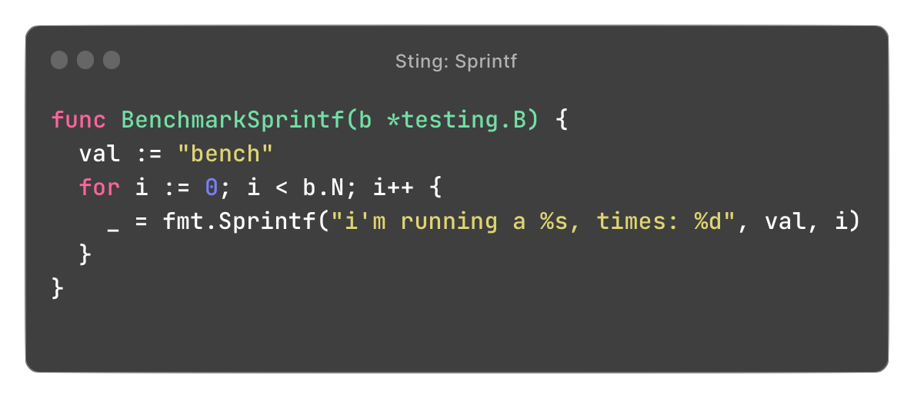
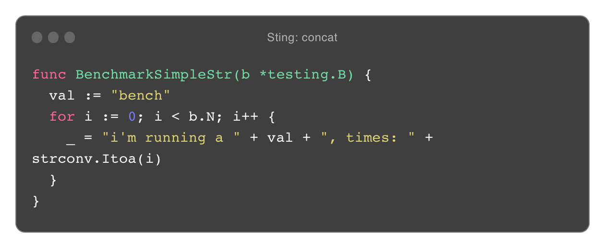

---

# Code quality - Benchmark tests

Quiz, which solution is faster?

**String: concat** is faster,

`109.0 ns/op` for **Sprintf**
`48.04 ns/op` for **concat**

about half can be saved by using simple `"str" + "other"` here.


---

# Code quality - Benchmark tests

Quiz, which solution is faster?

**Given the following**

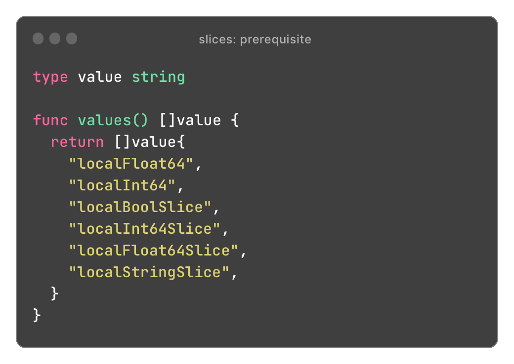

---

# Code quality - Benchmark tests

Quiz, which solution is faster?

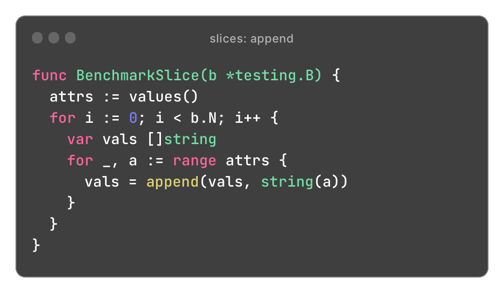
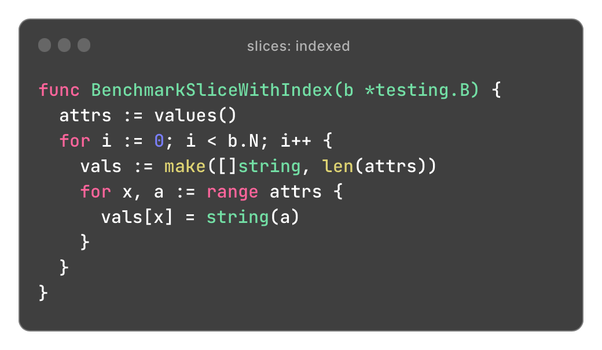
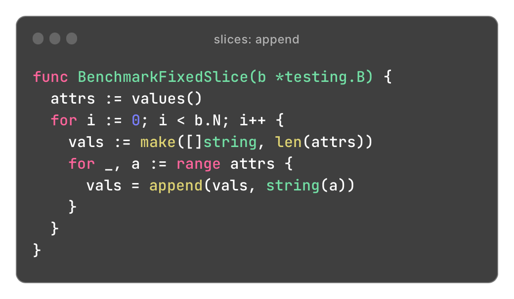

---

# Code quality - Benchmark tests

Quiz, which solution is faster?

**Slices: indexed** is faster,

`118.3 ns/op` for **append**

`76.71 ns/op` for **append with initialized size**
``32.09 ns/op`` for **indexed insertion**


---

# Code quality - Benchmark tests

> What happens under the hood

Most of the time is spend on growing the slice

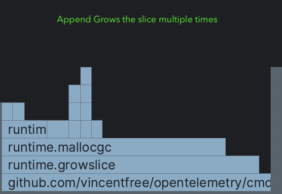

---

# Code quality - Benchmark tests

> What happens under the hood

Half of the time is still spend on growing the slice while the capacity should fit all elements.

 This probably due to the way append works, when nearing the end of the slice it still needs to grow to accommodate more data.


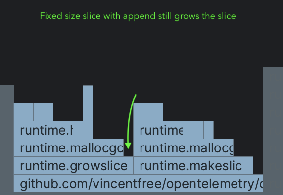

---

# Code quality - Benchmark tests

> What happens under the hood

No time is spend growing the slice due to the use of indexed insertion.

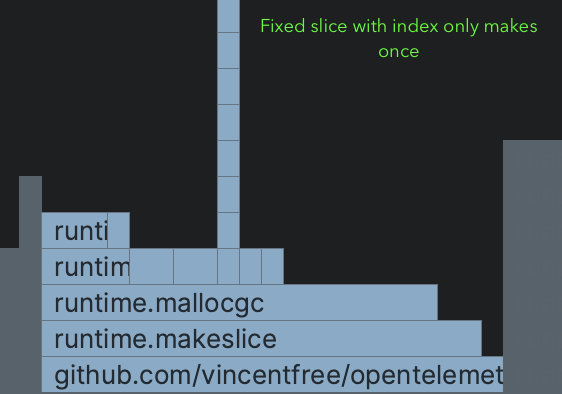

---

# Code quality - Benchmark tests

Why does this matter?

- Library performance impacts end users
  - Use cases differ

---

# Code quality - Fuzz tests

Inject random variables into your code to validate edge cases.

Supported types:

- `string`, `[]byte`
- `int`, `int8`, `int16`, `int32/rune`, `int64`
- `uint`, `uint8/byte`, `uint16`, `uint32`, `uint64`
- `float32`, `float64`
- `bool`

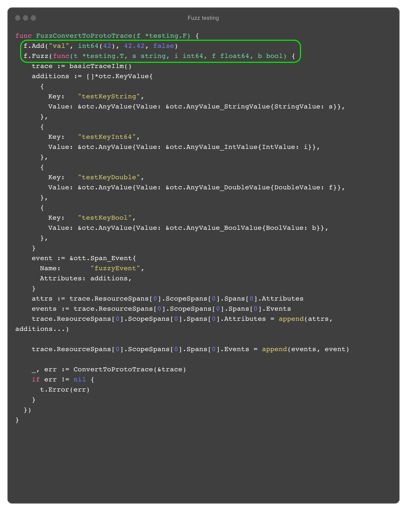

---

# Code quality - Example tests

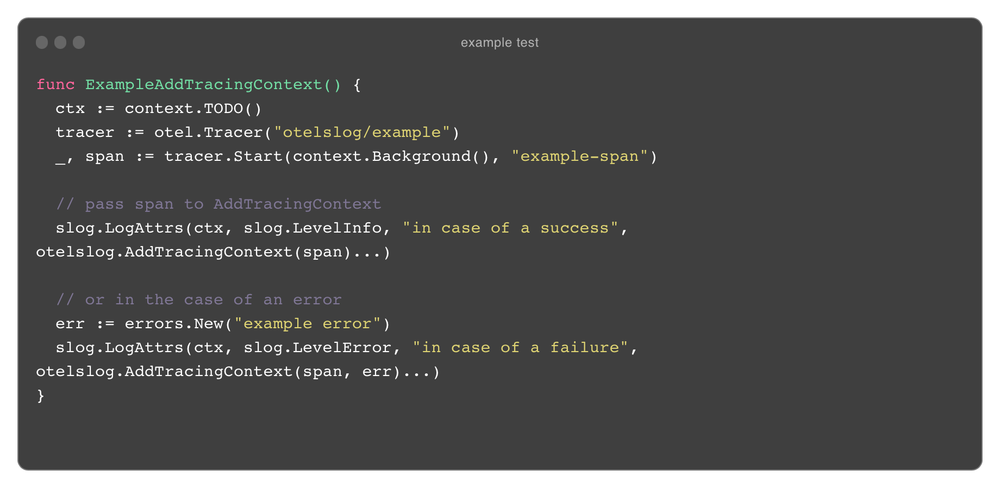

---

# Code quality - Example tests

Example test can also validate, that's why it's also a test

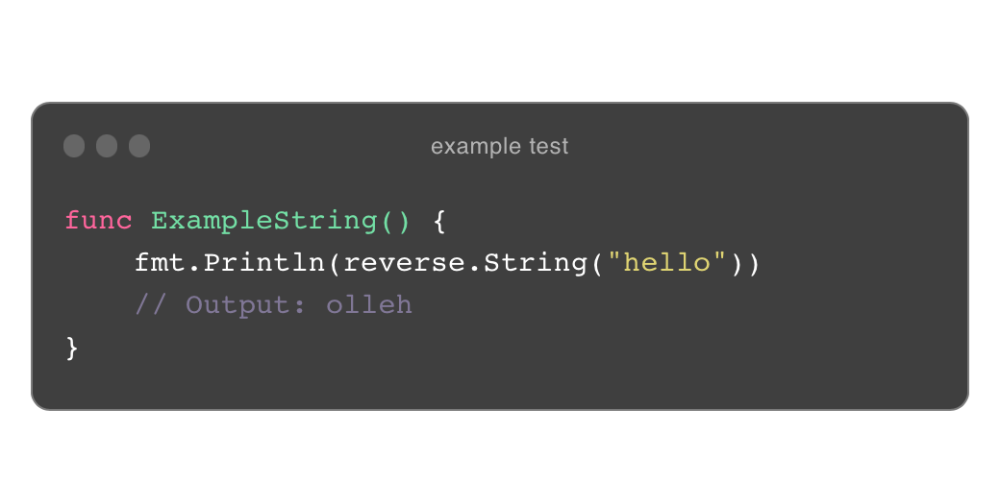

---

# Publish your work

To eventually publish a project to https://pkg.go.dev there are a few steps you can take. 

- Start with the docs on `https://go.dev`
- Git tag your release with a semver tag like: `v0.0.0`
  - for multiple libs per project use `<lib name>/v0.0.0`
- When our project is tagged the crawler picks it up eventually
  - to trigger the mirrors to pick your project up faster you have two options:
    - URL
    - Curl mirror


<!-- 
First start with the docs, there is a nice explanation on go.dev explaining what you can do to update the mirrors.
-->


---

<!-- _class: demo -->

# Demo

---

<!-- _class: questions -->

# Questions

---


